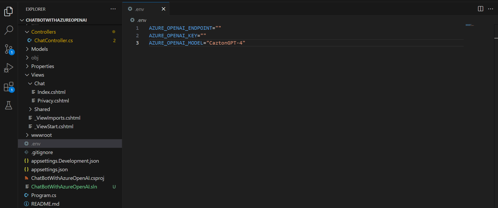

## Basic Chat bot using Azure OpenAI
This a simple web application, built on the .NET 8 framework, follows the MVC pattern. It enables users to ask questions in natural language using the Azure OpenAI service.
### Setup locally
1. Clone the source code
```
$> git clone https://github.com/iliass-de/chatbot-with-azure-openAI.git
```
2. Create an OpenAI resource in Azure 
https://learn.microsoft.com/en-us/azure/ai-services/openai/how-to/create-resource?pivots=web-portal
3. Add the .env file and update the settings

4. Run the application  
Navigate to the application path and run the following command:
```
$> dotnet run
```